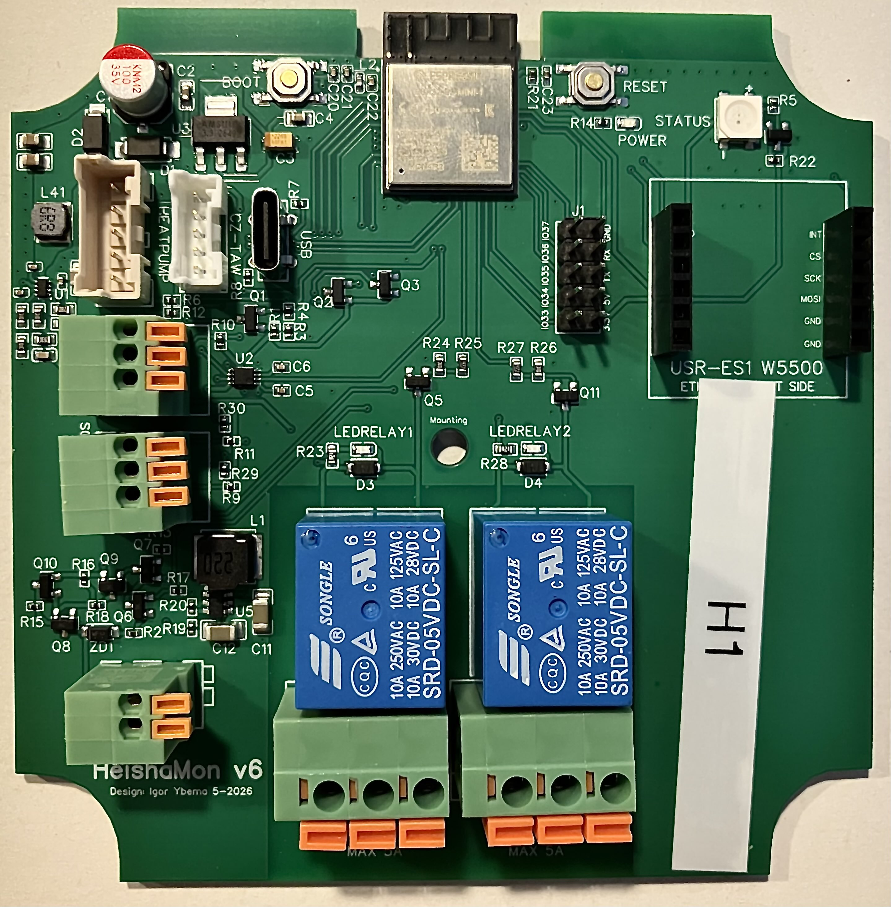
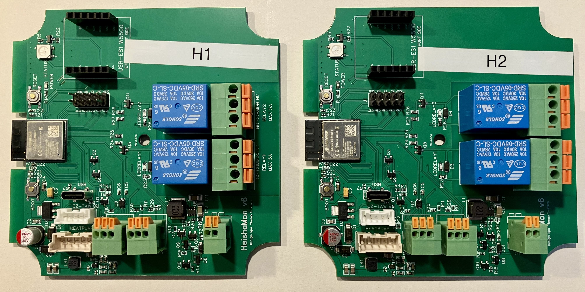
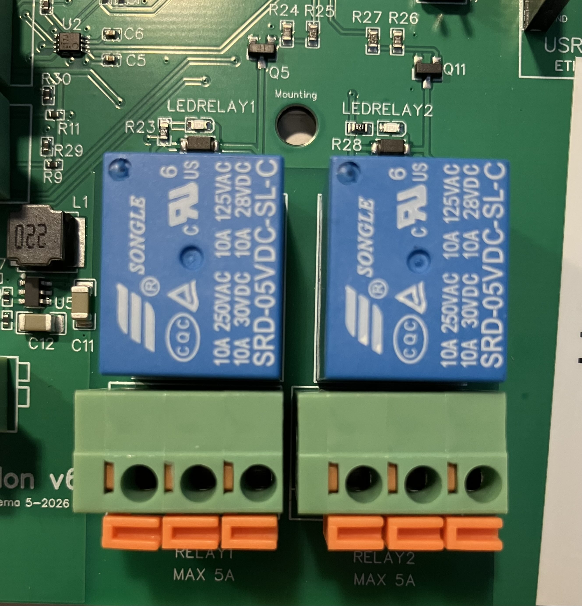

# HeishaMonKaskade

Eine Variante von [HeishaMon](https://github.com/Egyras/HeishaMon) für den
**Kaskadenbetrieb zweier Panasonic-Wärmepumpen** an einer übergeordneten
Steuerung (Node-RED/ioBroker). Läuft auf dem offiziellen
HeishaMon-ESP32-S3-Board.

> **Zugeschnitten heißt nicht festgelegt.** Set-Kommandos und Topics stehen in
> je einer Tabelle, Gerätespezifisches in Build-Flags — ein eigenes Topic ist
> eine Zeile, kein Umbau. Wie das geht, steht unter
> [Anpassen ist der Normalfall](#anpassen-ist-der-normalfall-nicht-der-sonderfall).

<p align="center">
  
</p>

<p align="center">
  <em><b>Das Stück Hardware, um das alles hier kreist:</b> HeishaMon v6, Design
  Igor Ybema. Die Buchse mit der Aufschrift <code>HEATPUMP</code> führt zum
  CN-CNT-Anschluss der Wärmepumpe — von dort kommen alle fünf Sekunden die
  203 Bytes, um deren richtige Deutung es auf den folgenden Bildschirmmetern
  geht. Rechts oben der unbestückte Sockel für die Ethernet-Platine — hier
  bleibt er leer, angebunden wird über WLAN. Das weiße Etikett ist nur für das
  Foto angebracht.</em>
</p>

---

## In English — what this is and whether it is for you

This is a fork of HeishaMon, reworked for a **cascade of two heat pumps driven
by an external controller** that sends several set commands at once, repeatedly,
forever. That use case exposed problems the original firmware does not show in
single-unit, hand-operated setups. The most important one:

> **Set topics that share a protocol byte silently overwrote each other.**
> Upstream assigns the whole byte; every other field in it falls back to
> `0 = no change`. Two set commands inside the same 500 ms collection window
> therefore cancelled each other — while the log still cheerfully confirmed both.
> This fork merges each value through a bit mask (`src/commands.cpp`).
> Measured proof: [`test/README.md`](test/README.md).

Other notable changes: range validation for every set command (with limits
*measured on the machine*, not copied from folklore), one data-driven table per
concern instead of four parallel arrays, no heap allocation in the decode path,
per-unit configuration via build flags, a CDN-free authenticated web UI, and a
set of diagnostic tools under `test/`.

**Not a drop-in replacement — but built to be re-cut.** It is tailored to one
specific installation (two units, no zone 2, a Node-RED cascade controller),
topic numbering has deliberate gaps, and the defaults are ours. Re-cutting it is
the easy part, though: every set command is one row in `setCommands[]` (byte,
bit mask, conversion, topic name, min, max), every published value one row in
`stateTopics[]`, and per-unit names live in build flags rather than in the code.
Take the ideas and the measurements, not the binary. Everything is documented —
the changelog in [`src/version.h`](src/version.h) explains not just *what*
changed but *why*, and what was measured to confirm it.

Documentation is in German from here on. The MQTT reference
[`MQTT-Topics.md`](MQTT-Topics.md) is in English.

---

## Worum es geht

Zwei Panasonic-Wärmepumpen laufen als Kaskade — WH-MDC05H3E5, 5-kW-Monoblöcke
und damit die Baureihe, mit der HeishaMon seinerzeit angefangen hat. Wer sie führt, wann welche
zuschaltet, mit welcher Vorlauftemperatur und welcher Pumpendrehzahl — das
entscheidet eine Steuerung in Node-RED unter ioBroker. HeishaMonKaskade ist die
**Schnittstelle** dazwischen: je ein Mikrocontroller pro Wärmepumpe, angebunden
an deren CN-CNT-Anschluss, der das Panasonic-Protokoll nach MQTT übersetzt und
Kommandos in die Gegenrichtung.

```
   Node-RED / ioBroker                MQTT-Broker            HeishaMonKaskade        Wärmepumpe
   (Kaskadenlogik, Wächter)  <---->   (hier: ioBroker-  <---->  Stufe 1 (ESP32)  <---->  WP1
                                       mqtt-Adapter)      <---->  Stufe 2 (ESP32)  <---->  WP2
```

<p align="center">
  
</p>

<p align="center">
  <em><b>Die Geschwister.</b> Sie sehen nicht nur gleich aus, sie tragen auch
  denselben Quelltext — der ganze Unterschied zwischen Stufe 1 und Stufe 2 sind
  drei Build-Flags (MQTT-Präfix, Web-Titel, Hostname). Im Projekt laufen sie
  deshalb unter <code>…_h1_ota</code> und <code>…_h2_ota</code>. Die beiden
  Ersatzplatinen tragen <b>denselben</b> Build wie ihre Stufe — eigene Envs
  gibt es dafür nicht, sie unterscheiden sich nur im Hostnamen und in einem
  toten MQTT-Port, der sie stilllegt. Die Aufkleber auf dem Foto sind nur für
  das Foto. Genau diese Verdopplung hat die
  Fehler ans Licht gebracht, die weiter unten stehen: Ein Gerät, das jemand von
  Hand bedient, verzeiht vieles. Zwei Geräte, die alle fünf Minuten den
  kompletten Sollzustand aufgedrückt bekommen, verzeihen nichts.</em>
</p>

Die Wärmepumpen-Firmware selbst ist Panasonic-Code und wird nicht angefasst.
Sicherheitsrelevante Vorgänge (Abtauen, Frostschutz) entscheidet die Wärmepumpe
allein.

Was diesen Einsatz von der üblichen HeishaMon-Nutzung unterscheidet: Die
Steuerung schickt **mehrere Set-Kommandos gleichzeitig**, an **zwei Geräte**,
und wiederholt den kompletten Sollzustand **alle 5 Minuten** (Re-Assert). Genau
dieses Muster hat Fehler sichtbar gemacht, die im Einzelbetrieb mit
Handbedienung niemandem auffallen.

Und dann ist da noch die Zeitachse. Die beiden Bridges hängen im Keller, ohne
Bildschirm, ohne dass jemand hinschaut, und sollen **Monate am Stück** laufen.
Die spannende Frage ist dabei nicht „funktioniert es?" — sondern „würde ich es
überhaupt mitbekommen, wenn nicht?". Was daraus geworden ist, steht unter
[Damit es Monate durchhält](#damit-es-monate-durchhält--und-man-merkt-wenn-nicht-3200).

## Anpassen ist der Normalfall, nicht der Sonderfall

Diese Firmware ist für *eine* Anlage konfiguriert — aber sie ist so gebaut, dass
das Umkonfigurieren die leichteste Übung daran ist. Ein Set-Kommando sieht hier
vollständig so aus ([`src/commands.cpp`](src/commands.cpp)):

```c
// Nr pos mask conversion    topic-name     min  max  param
{ 3,  7, 0xFF, CONV_MUL_INC, "QuietMode",     0,   3,   8}, // level -> (n+1)*8
```

Protokollbyte 7, Bitmaske, Umrechnung, Topic-Name, erlaubter Bereich — mehr
nicht. Das Abonnement läuft über dieselbe Tabelle, die Bereichsprüfung auch.
Im Original wollte ein neues Kommando an vier Stellen gepflegt werden, und wer
eine davon vergaß, bekam *keinen* Compilerfehler: Das Topic war einfach stumm.

Die gelesenen Werte genauso — eine Zeile je Topic in `stateTopics[]`
([`src/decode.cpp`](src/decode.cpp)), mit Byte, Dekodierer und Klartextliste.
Und was ein Gerät von seinem Nachbarn unterscheidet (MQTT-Präfix, Hostname,
Titel der Weboberfläche), steht in Build-Flags in `platformio.ini`, nicht im
Quelltext.

Was heißt das praktisch?

| Vorhaben | Aufwand |
| --- | --- |
| Eigene Topic-Namen, eigenes MQTT-Präfix | Build-Flags, kein Code |
| Ein Set-Kommando ergänzen | eine Zeile in `commands.cpp` |
| Ein Topic ergänzen | eine Zeile in `decode.cpp` + Zeilenzahl in `decode.h` |
| Zone 2 zurückholen | die entfernten Tabellenzeilen wieder eintragen |

Die Zeilenzahl in `decode.h` von Hand nachzuziehen klingt nach Fußangel, ist
aber Absicht: Ein `static_assert` vergleicht sie mit der Tabelle, ein Vertippen
fällt also beim Übersetzen auf und nicht im Betrieb.

Und wenn unklar ist, *welches* Byte man überhaupt braucht: Dafür liegen die
Werkzeuge in [`test/`](test/README.md) bereit. `byte_monitor.py` zeigt am
laufenden Gerät, welches Byte sich bewegt, wenn man am Bedienteil etwas
verstellt: Das mitwandernde Byte trägt den Wert, alles andere ist Vermutung.
`top_watch.py` schreibt den Verlauf im 5-Sekunden-Takt mit, `tablesnap.py` macht
die Abnahme nach dem Flashen zu einem `diff`. Genau so sind die
Wertebereiche in diesem Repo entstanden: gemessen, nicht abgeschrieben.

Dazu die Doku: [`MQTT-Topics.md`](MQTT-Topics.md) listet jedes Set-Kommando
mit Protokollbyte und Wertebereich und jedes Sensor-Topic mit seiner Bedeutung,
[`SET-TOP-Zuordnung.md`](SET-TOP-Zuordnung.md) sagt zu jedem Set-Kommando, woran
man sein Ankommen abliest, und der Changelog in
[`src/version.h`](src/version.h) nennt zu jeder Änderung das Problem, den
Nachweis und den Preis in RAM und Flash. Man muss hier nichts raten.

## Für wen das interessant sein könnte

Dieses Repo ist **öffentlich, aber nicht allgemeingültig**. Es ist auf eine
konkrete Anlage zugeschnitten: zwei Geräte, keine Zone 2, feste MQTT-Präfixe,
eine bestimmte Steuerung dahinter. Wer es für die eigene Anlage nutzen will,
fasst vorher zwei Tabellen und drei Build-Flags an — der Weg dahin steht oben,
und er ist keine Operation am offenen Herzen.

Zu holen ist hier aber noch mehr — für alle, die eine eigene Umsetzung bauen:

* **Der Bitmasken-Fund** betrifft jede Installation, die mehr als ein
  Set-Kommando gleichzeitig schickt. Er ist hier belegt und behoben.
* **Die ausgemessenen Wertebereiche** der Kurvenparameter. Die verbreiteten
  Angaben stimmen für diese Geräte nicht — das Original-Projekt prüft
  Wertebereiche überhaupt nicht, die Zahlen stammen also nicht von dort.
* **Die Refactorings** (datengetriebene Tabellen, String-freier Dekodierpfad,
  Konfiguration über Build-Flags) sind unabhängig vom Kaskadenthema übertragbar.
* **Die Werkzeuge in [`test/`](test/README.md)** lösen wiederkehrende Probleme:
  Wie weise ich an einer *laufenden* Anlage nach, dass ein Kommando ankommt,
  ohne den Betrieb zu stören? Wie vergleiche ich zwei Dekodierstände, *bevor*
  ich flashe?
* **Der Changelog** in [`src/version.h`](src/version.h) ist bewusst
  ausführlich: zu jeder Änderung steht dort das Problem, der Nachweis und die
  Größenänderung in RAM und Flash.

## Was gegenüber dem Original anders ist

| Thema | Original | Hier |
| --- | --- | --- |
| Gleichzeitige Set-Kommandos | Byte wird als Ganzes zugewiesen — Felder löschen sich gegenseitig | Bitgenauer Merge über Maskenspalte, Konflikt-Warnung im Log |
| Wertebereiche | keine Prüfung (`cmd[75] = wert + 128`) | Min/Max je Kommando, an der Anlage ausgemessen |
| Set-Kommandos | im Code verteilt | eine Tabelle `setCommands` |
| State-Topics | vier positionsgleiche Parallel-Tabellen | eine Tabelle `stateTopics` |
| Zonen | Zone 1 + Zone 2 | nur Zone 1 (Anlage hat keine zweite Zone) |
| Hardware | getrennte Codebasen je Board | nur ESP32-S3 (der ESP8266-Zweig lief bis 3.15.0 aus derselben Codebasis mit) |
| Gerätespezifisches | Code anpassen | Build-Flags je Stufe |
| Web-UI | jQuery/CSS vom CDN | inline, ohne externe Abhängigkeiten, mit Auth |
| Dekodierpfad | `String`-Objekte | feste Puffer, keine Heap-Allokation |
| Empfangenes Telegramm | Prüfsumme entscheidet allein | zusätzlich Typ (0x71) und Länge (203) |
| WLAN-Ausfall | keine Prüfung im Betrieb | Watchdog: Reconnect nach 30 s, Neustart nach 5 min |
| Byte 110 | nicht dekodiert | vier Topics mit den Ist-Zuständen (heizt/kühlt tatsächlich) |
| Broker weg | nur eine Zeile im MQTT-Log, die niemanden erreicht | die Weboberfläche sagt es: „Hausteuerung seit 14 Minuten nicht erreichbar" |
| Steuerung rechnet nicht mehr | fällt gar nicht auf, von außen sieht alles gesund aus | erkannt am ausbleibenden 5-min-Re-Assert, eigener Text auf der Seite |
| Heizstab-Auftrag beim Notbetrieb | kennt keinen Notbetrieb | wird als eigener Schritt zurückgenommen, bevor die Anlage anläuft |
| Unbemerkte Neustarts | keine Spur — das Gerät ist binnen Sekunden wieder „Online" | Bootzähler und Reset-Ursache als Topics, ein Watchdog-Neustart fällt auf |
| Speicherverbrauch | über Telnet als Prozentwert relativ zum Boot | vier Zahlen als Topics, in InfluxDB auftragbar |
| Notbetriebswerte nach einem Neustart | kennt keinen Notbetrieb | überleben im RTC-Speicher; erst ein Stromausfall räumt sie weg |
| Logzeilen bei weggefallenem Broker | verschwinden still | Ringpuffer im RAM, Route `/log`, zusätzlich Telnet |
| Logzeitstempel | driften, kennen keine Sommerzeitumstellung | aus der von SNTP nachgeführten Systemuhr |

Im Detail:

### Damit es Monate durchhält — und man merkt, wenn nicht (3.20.0)

Irgendwann ist der spannende Teil vorbei. Die Topics stimmen, die Kommandos
kommen an, der Notbetriebsknopf tut, was er soll. Und dann steht das Ding im
Keller und soll einfach laufen. Ein halbes Jahr. Ohne dass jemand hinschaut.

Genau dafür ist die ganze Firmware im September 2026 noch einmal durchgelesen
worden — nicht mit der Frage „ist das richtig?", sondern mit der deutlich
unangenehmeren: **„was davon würde ich merken, wenn es schiefgeht?"** Der
Befundbericht liegt als
[`Massnahmenplan-Codedurchsicht-2026-09-02.md`](Massnahmenplan-Codedurchsicht-2026-09-02.md)
im Repo, die Umsetzung samt Messprotokoll als
[`Arbeitsplan-Robustheit-3.20.0.md`](Arbeitsplan-Robustheit-3.20.0.md).
Herausgekommen sind vier Dinge.

**Die Notbetriebswerte überleben jetzt einen Neustart.** Sie lagen bis dahin
nur im RAM — mit der durchaus vernünftigen Begründung: Wenn die Bridge neu
startet, während der Broker weg ist, war der Strom weg, und dann läuft ohnehin
nichts. Nur stimmt das nicht mehr, seit die Firmware sich *selbst* neu startet:
WLAN-Watchdog nach fünf Minuten ohne Netz, `/reboot`, jedes OTA. Der ungünstige
Fall ist unangenehm konkret — der Server im Keller ist tot (das *ist* der
Notbetriebsfall), und gleichzeitig zieht sich der Router ein Update rein, das
länger als fünf Minuten dauert. Bridge startet neu, Werte weg, und der Knopf
sagt „Nicht bereit" in genau dem Moment, für den er gebaut wurde.

Jetzt liegt eine Kopie im RTC-Speicher — dem kleinen Stück RAM, das der ESP32
über einen Software-Reset hinweg nicht anfasst. Sie überlebt Neustart, Watchdog
und OTA, und **einen Stromausfall überlebt sie nicht**. Das ist kein Versehen,
sondern die Grenze, die bewusst so gezogen wurde: kein Schreiben ins Flash,
keine Datei, nichts, was Monate alte Werte in eine Anlage tragen könnte, die
inzwischen ganz woanders steht. Die Prüfung, ob dem Inhalt zu trauen ist, steht
arduino-frei in [`src/rtcspiegel.h`](src/rtcspiegel.h) und wird von
[`test/rtcspiegel_test.cpp`](test/rtcspiegel_test.cpp) mit 42 Zusicherungen
auseinandergenommen — Bitkipper, falsche Rolle, Spiegel der Vorversion nach
einem Update, Zähler am Überlauf.

**Das Gerät sagt jetzt, wenn es neu gestartet ist.** Vorher: gar nichts. Ein
Watchdog-Neustart, ein Brownout, eine Panic — nichts davon hinterließ eine
Spur, das LWT war binnen Sekunden wieder `Online`, und von außen sah alles
gesund aus. Ein Gerät, das alle drei Tage neu startet, wäre schlicht nicht
aufgefallen. Unter `<prefix>/info/` stehen deshalb jetzt acht Zahlen:
Bootzähler, Reset-Ursache und Version einmal je Verbindung, dazu Laufzeit,
freier Heap, kleinster je gesehener Heap, größter zusammenhängender Block und
der Rest-Stack im Fünf-Minuten-Takt.

Der Bootzähler liegt im selben RTC-Block wie die Notbetriebswerte und zählt
damit genau das, was ein Stromausfall wegräumt. Steht er auf 1, war das Gerät
stromlos. Steht er höher, hat die Firmware sich selbst neu gestartet — und die
Reset-Ursache sagt, warum. Alles als einzelne Zahlen und nicht als JSON-Zeile,
damit ioBroker sie als Zahlen führt und man sie in InfluxDB auftragen kann: Ein
Sprung in der Kurve ist ein Neustart, ein über Tage fallender Heap-Tiefpunkt
ein Leck.

**Das Log verschwindet nicht mehr genau dann, wenn man es braucht.** Alle
Meldungen des Notbetriebs — „Schritt 3/10", „ROT: … kam nicht zurück", die
Antwort des Hydraulik-Schalters mit HTTP-Code — gingen ins MQTT-Log und sonst
nirgends. Im echten Notbetriebsfall ist der Broker aber weg. Das Publish
scheitert still, und nach dem 15-Minuten-Anzeigeverfall war nirgends mehr
nachlesbar, warum ein Lauf rot war. Jetzt landet jede Ereigniszeile zuerst in
einem Ringpuffer im RAM (32 Zeilen, fest, kein Heap), geht dann ins MQTT-Log —
und wenn das nicht klappt, nach Telnet. Die letzten Meldungen stehen unter
`/log`, hinter demselben Zugang wie der Notbetriebsknopf, verlinkt von dessen
Seite. Der Ring überlebt keinen Neustart; dass es einen gab, sieht man jetzt ja
am Bootzähler.

**Und die Zeitstempel stimmen wieder.** Die Loguhr wurde beim Booten einmal
gestellt und lief danach frei auf `millis()` weiter — über Monate driftet das,
und die Umstellung im Oktober erreichte sie erst beim nächsten Neustart. Jetzt
liest sie die Systemuhr, die im Hintergrund von SNTP nachgeführt wird. Und wenn
gar keine Zeit da ist, stempeln die Zeilen auf die Laufzeit (`+01:23:45`) statt
auf `1970-01-01` — was nach einem Stromausfall ohne Internet der Normalfall ist
und die Zeilen sonst alle gleich aussehen ließe.

#### Und dann kam die Messung dazwischen

Der interessanteste Teil war nicht das Bauen, sondern der Versuch, den ersten
Befund am Gerät nachzustellen. Es ging um das Karenzfenster aus
[3.6.1](#der-broker-spielt-beim-verbinden-alles-wieder-ein-361): Nach jedem
Verbinden schickt der ioBroker-Adapter den gespeicherten Wert *jedes*
abonnierten Set-Topics hinterher, teils Monate alt, und die Firmware verwirft
diesen Schwall fünf Sekunden lang. Der neue Befund lautete: Das Fenster startet
in `setupMqtt()`, gelesen wird der Schwall aber erst nach `setup()` — und
dazwischen wartet die Zeitsynchronisation bis zu 30 Sekunden auf einen
Zeitserver. Ist das Fenster dann zu, läuft alles durch.

Die im Bericht vorgeschlagene Prüfung war: Zeitserver unerreichbar machen,
neu starten, mitschneiden. **Sie liefert grün — und prüft dabei nichts.** Zwei
unabhängige Gründe, beide erst am Gerät sichtbar geworden:

* Die **Systemuhr überlebt einen Software-Neustart**. Nach `/reboot` und nach
  jedem OTA findet die Zeitsynchronisation sofort eine plausible Uhrzeit und
  wartet gar nicht erst. Gemessen: Neustart 10:29:16, erste Logzeile 10:29:26 —
  mit korrekter Uhrzeit, bei unroutbarem Zeitserver. Der Befund ist also
  ausschließlich ein *Kaltstart*-Thema.
* Und selbst der Kaltstart löst ihn nicht aus, solange der Broker mitspielt:
  Der ioBroker-MQTT-Adapter **trennt stille Verbindungen nach rund 30 Sekunden**
  von selbst. Die Bridge verliert die Verbindung also mitten in der Wartezeit,
  verbindet danach neu — und das frische Abonnement armiert das Fenster wieder.

Womit die Aussage im Bericht, der Keepalive rette hier nicht, schlicht falsch
war. Der Befund selbst ist trotzdem echt: Mit einer auf 10 Sekunden verkürzten
NTP-Frist endet der Start unterhalb der Trennschwelle, die Verbindung bleibt
stehen, das Fenster ist wirklich abgelaufen — und dann läuft der Schwall
vollständig durch. Fünfzehn ausgeführte Set-Kommandos im Log, die beiden
Kurvenpunkte mittendrin. Dieselbe Lage mit 3.20.0: null ausgeführt, alle
verworfen.

Der Fix bleibt damit richtig, aber seine Begründung ist eine andere geworden.
Er schützt nicht vor etwas, das hier ständig passiert — er macht die Firmware
unabhängig davon, ob ein Broker stille Verbindungen aufräumt. Ein
ioBroker-Update, ein anderer Broker, ein Zeitserver, der schon nach zwölf
Sekunden aufgibt: Jedes davon nimmt diese unfreiwillige Rettung wieder weg.

Nachgestellt wurde das alles auf einem **Backup-Board als Leihgabe** — eigener
MQTT-Präfix, keine Wärmepumpe dran, und der Hydraulik-Schalter auf einen
Platzhalter umgebogen, damit ein Testlauf nicht die echte Hydraulik des Hauses
umlegt. Vier Prüfpunkte, mehrere Kaltstarts von Hand, danach das Board wieder
in den Auslieferungszustand. Zwei Fehler in der neuen Firmware sind dabei noch
aufgefallen und behoben worden, darunter Logzeilen, die vor dem Setzen der
Zeitzone entstehen und deshalb zwei Stunden zurücksprangen — im Ringpuffer, der
für die Nachschau nach einem Störfall gebaut ist, ausgerechnet.

#### Was es gekostet hat

RAM 57 528 → 61 608 Byte, davon 4 096 der Ringpuffer; der Rest hebt sich mit
dem Wegfall der Zeitbibliothek auf. Flash 1 211 105 → 1 213 049 Byte. Die
Abnahme auf beiden Stufen war zeilengleich bis auf laufende Messwerte, kein
Sollwert hat sich bewegt.

Und die ersten Zahlen aus dem Dauerbetrieb, seit es sie zu sehen gibt: freier
Heap-Tiefpunkt 188 916 (Stufe 1) und 220 676 Byte (Stufe 2), größter Block
172 020 bzw. 176 116, Rest-Stack 4 184 bzw. 4 036 von 8 192. Der Unterschied
zwischen den Stufen ist der volle Dekodierpfad — das Testboard ohne Wärmepumpe
lag rund 25 KB höher. Genau deshalb arbeitet der Wächter auf der ioBroker-Seite
mit Grenzen, die sich pro Gerät selbst eichen, statt mit festen Zahlen aus
einer Labormessung.

### Der Notbetrieb nimmt den Heizstab zurück (3.18.0)

Seit dem 2026-08-30 benutzt die Kaskadensteuerung SET39 `ForceHeater` im
**Regelbetrieb**: Drei Heizmodi ersetzen den Verdichter durch den Backup-Heizstab
der Wärmepumpen — 3 kW an einer Stufe, 6 kW mit beiden. Sie schalten die Einheit
dafür aus, denn die Wärmepumpe nimmt SET39 nur bei ausgeschalteter Einheit an.

Damit war der Notbetriebsknopf plötzlich in einer Lage, für die er nicht gebaut
war. Seine Schrittfolge kannte SET39 nicht und endet mit `Heatpump = 1` — sie
hätte **eine Anlage eingeschaltet, an der der Heizstab-Auftrag noch steht**.
Zurückgenommen hätte ihn niemand: Die Firmware hat keinen Rückschaltpfad, und im
eigentlichen Notbetriebsfall ist die Steuerung ja gerade weg.

**Der eigentliche Schaden wäre die Umwälzpumpe gewesen.** Sie hängt am Kommando,
nicht am Heizstab (gemessen 2026-08-28): Sie startet mit SET39, läuft weiter,
nachdem der Stab thermisch abgeschaltet hat, und stoppt erst mit
`ForceHeater = 0`. Ein vergessenes Kommando lässt sie dauerhaft laufen.

Beide Schrittfolgen haben deshalb an **Position 2** einen Schritt
`ForceHeater = 0` — hinter der Hydraulik, vor allem anderen an der Wärmepumpe.
Die Stelle ist mit Absicht so früh: Bricht der Lauf dort ab, tut die Anlage
nichts mehr — Stab aus, Pumpe aus, Wärmepumpe aus, und an der Wärmepumpe ist
nichts verstellt.

* **Im Regelfall kostet er 8 s.** Wer nie einen Heizstab-Modus fährt, hat TOP68
  ohnehin auf 0; der Schritt ist dann nach der Mindestwartezeit bestätigt. Ein
  Heizen-Lauf dauert damit 80 s statt 72, ein Warmwasser-Lauf 48 statt 40.
* **Das Timeout bleibt bei 20 s.** Beim *Einschalten* braucht SET39 bis zu einer
  halben Minute — die Wärmepumpe prüft erst ihre eigenen Bedingungen. Die
  *Rücknahme*, um die es hier geht, lag bei 7 s an beiden Stufen.
* **Lief die Anlage mit 6 kW, gehört der Knopf an beide Bridges.** Jede spricht
  nur mit ihrer eigenen Wärmepumpe. Sonst bleibt an der anderen Stufe der
  Auftrag stehen und ihre Umwälzpumpe läuft weiter.

Der Auftrag kam von der Steuerungsseite und ist samt Antwort in
[`Auftrag-Heizstab-Notbetrieb.md`](Auftrag-Heizstab-Notbetrieb.md) nachlesbar;
der Schritt im Ablauf steht in
[`Ablauf-Notbetrieb.md`](Ablauf-Notbetrieb.md) Abschnitt 1b.

### Der Heizstab lässt sich schalten — und was er dabei tut (3.17.0)

**Wozu das gut ist — und wozu nicht.** Der Heizstab ist eine Ersatzwärmequelle,
keine Alternative zum Verdichter: Er macht aus 3 kW Strom 3 kW Wärme, der
Verdichter aus 1 kW Strom drei bis vier. Wer bei laufendem Verdichter mit dem
Stab heizt, zahlt das Drei- bis Vierfache für dieselbe Wärme. Interessant wird
er, wenn der Verdichter **nicht** kann oder nicht soll — und dann ist es gut,
wenn das Kommando erprobt ist, statt im Ernstfall zum ersten Mal benutzt zu
werden.

Drei Set-Kommandos für den internen Heizstab: SET37 `RoomHeaterState` und
SET38 `DHWHeaterState` geben ihn frei (Byte 9), SET39 `ForceHeater` schaltet
ihn an (Byte 5). Die Kommandos gibt es auch im Original-Projekt; hier sind sie
**bitgenau maskiert** — Byte 9 trägt beide Freigaben in zwei Bitfeldern, an
dieser Anlage dazu zwei weitere belegte Gruppen. Ohne Maske fiele das Byte beim
Schreiben auf `0x02` zusammen und legte drei Felder auf einmal um.

**Am 2026-08-28 an Stufe 1 gemessen**, jeder Eingriff einzeln, Byte im
laufenden Mitschnitt (`test/byte_monitor.py`):

| Kommando | Byte | Rücklesen | Nachbarfelder |
| :--- | :--- | :--- | :--- |
| `RoomHeaterState 0` / `1` | 9: `0x56` → `0x55` → `0x56` | TOP59 `Free` → `Blocked` → `Free` | unverändert |
| `ForceHeater 1` / `0` | 5: `0x55` → `0x59` → `0x55` | TOP68 `Inactive` → `Active` → `Inactive` | unverändert |

Damit ist belegt, dass die WH-MDC05H3E5 beide Bytes annimmt und dass jedes
Kommando nur seine eigene Bitgruppe anfasst.

#### Was beim Schalten von SET39 tatsächlich passiert

Zweiter Lauf am selben Abend, mit Verlaufsmitschrieb im 5-Sekunden-Takt
(`test/top_watch.py`), im Ruhefenster der Kaskadensteuerung. **Die Wärmepumpe
war dabei ausgeschaltet** (`Heatpump_State` = 0, Kompressor 0 Hz), die
Umwälzpumpe stand, die Außentemperatur lag bei 17 °C:

| Zeit | Kommando | Was die Anlage tat |
| :--- | :--- | :--- |
| 21:43:11 | `set/ForceHeater 1` | — |
| 21:43:19 | | TOP68 `Active`, **die Umwälzpumpe läuft an** — 0 → 2300 1/min, 11,95 l/min |
| 21:43:27 | `set/Z1HeatRequestTemperature 30` | Sollwert steht 21:43:34 in TOP7 |
| 21:45:31 | | **TOP60 `Active`, TOP16 = 3000 W** — der Heizstab heizt |
| 21:45:57 | `set/Z1HeatRequestTemperature 20` | Sollwert steht 21:46:06 in TOP7 |
| 21:46:16 | | **TOP60 `Inactive`, 0 W** — Heizstab aus, **Pumpe läuft weiter** |
| 21:46:37 | `set/ForceHeater 0` | — |
| 21:46:47 | | TOP68 `Inactive` |
| 21:46:57 | | **Pumpe steht** (2300 → 0 1/min) |

Der Vorlauf stieg dabei von 22,5 auf 25,5 °C, der Rücklauf von 21,0 auf
23,0 °C, der Durchfluss lag konstant bei rund 12 l/min. 3000 W elektrisch für
3 kW thermisch.

Drei Dinge, die dieser Lauf zeigt:

* **Die Umwälzpumpe hängt am Kommando, nicht am Heizstab.** Sie läuft an,
  sobald TOP68 aktiv wird — noch bevor überhaupt eine Wärmeanforderung besteht
  —, sie läuft weiter, nachdem der Heizstab abgeschaltet hat, und sie stoppt
  erst, wenn SET39 zurückgenommen wird. **Wer das Kommando setzt und vergisst,
  lässt die Pumpe dauerhaft laufen**; sichtbar an TOP65 `Pump_Speed` und TOP1
  `Pump_Flow`.
* **Die Vorlaufregelung der Anlage arbeitet mit.** Der Heizstab schaltete von
  selbst ab, als der Vorlauf über die Stoppschwelle stieg — die Temperaturführung
  bleibt also bei der Wärmepumpe, eine externe Steuerung setzt nur den Sollwert.
* **Zeiten:** Der Heizstab lief 2:20 min nach dem Kommando an. Die Übernahme von
  SET39 selbst schwankt — 8 s und 10 s in diesem Lauf, rund eine halbe Minute in
  einem früheren am selben Tag. Wer direkt nach dem Senden zurückliest, sieht
  den alten Wert und hält das Kommando leicht für verworfen.

Ein Zähler taugt dafür übrigens nicht: TOP90 `Room_Heater_Operations_Hours`
blieb über den ganzen Lauf stehen. Für kurze Läufe sind TOP60 und TOP16 die
Zeugen. **Er ist dabei nicht blind, sondern träge**: Am 2026-08-30 sprang er
mitten in einem Takt von 269 auf 270 — er summiert die Laufzeit und springt bei
der vollen Stunde. Kurze Läufe sind darin unsichtbar, aber nicht verloren.

#### Die Sperre gilt in beide Richtungen

`SET39` wird nur bei **ausgeschalteter** Einheit angenommen — das Bedienpanel
sagt es im Klartext, wenn man es bei laufender Anlage versucht. Die Umkehrung
steht nirgends und ist die teurere Falle:

> **Solange `ForceHeater` steht, bleibt ein `Heatpump = 1` wirkungslos.** Die
> Wärmepumpe schaltet nicht ein, verwirft stattdessen den Heizstab-Auftrag und
> lässt den Einschaltwunsch fallen. **Ohne Fehlermeldung** — auf dem
> Protokollweg bewirkt das Kommando einfach nichts.

Am 2026-08-30 in zwei Varianten gemessen:

| Ausgangslage | Kommando | Ergebnis |
| :--- | :--- | :--- |
| TOP68 = 1, Kommando allein | `Heatpump = 1` | TOP0 bleibt 0 über 48 s, TOP68 fällt nach 10 s **von selbst** auf 0 |
| TOP68 = 1, `ForceHeater = 0` **im selben Telegramm** | `Heatpump = 1` | TOP0 geht 6 s auf 1 und **fällt zurück** — an beiden Stufen parallel |
| TOP68 = 0 | `Heatpump = 1` | TOP0 geht nach 10 s auf 1 und bleibt |

**Es genügt also nicht, die Rücknahme vor das Einschalten zu stellen — sie
braucht zeitlichen Abstand.** Kommandos, die binnen zwei Sekunden eintreffen,
fasst diese Firmware zu *einem* Telegramm zusammen (siehe Sammelfenster); aus
Reihenfolge wird dann Gleichzeitigkeit. Rund zehn Sekunden reichen: Die
Rücknahme ist nach sieben Sekunden zurückgelesen. Der Notbetrieb löst das über
den Abstand seiner Schritte ([Abschnitt oben](#der-notbetrieb-nimmt-den-heizstab-zurück-3180)).

#### TOP68 ist der Auftrag, TOP60 die Wirkung

Zwei Topics, die man nicht verwechseln darf — belegt an einem Lauf über
63 Minuten am 2026-08-30:

| | TOP68 `Force_Heater_State` | TOP60 `Internal_Heater_State` |
| :--- | :--- | :--- |
| bedeutet | der von der WP übernommene **Auftrag** | ob der Stab **gerade heizt** |
| im Lauf | **keine einzige Flanke** | vier Wechsel |
| taugt für | Befehlsquittierung | Wirkungsbeobachtung, Takten |

**Wer prüfen will, ob ein Kommando angekommen ist, liest TOP68.** Eine
Überwachung auf TOP60 hätte in diesem einen Lauf zwei Fehlalarme geworfen, denn
der Stab taktet von selbst: Die Vorlaufregelung der Anlage schaltete ihn bei
25,5 und 25,8 °C ab und bei 24,0 und 23,5 °C wieder ein, der Verdichter stand
dabei durchgehend auf 0 Hz. Zwischen Abschalten und Wiedereinschalten liegen
**20 Minuten Sperrzeit** — im Lauf auf die Sekunde 20:01 min.

Ablauf, Rohwerte und die Herleitung aus dem Servicehandbuch stehen in
[`Vorhaben-HeaterSet.md`](Vorhaben-HeaterSet.md), die Wiederholung des Laufs in
[`test/README.md`](test/README.md).

### Der Notbetrieb stellt die Hydraulik selbst um (3.15.0)

Der Notbetriebsknopf setzt hydraulisch **1-stufigen** Betrieb voraus — und bis
3.14.2 stellte das niemand sicher. Das ist kein Randfall: Steht die Hydraulik
auf 2-stufig, während eine Stufe im Warmwasser-Notbetrieb läuft, schiebt der
Warmwasserbetrieb **bis zu 57 °C in den Heizkreis.** Die Fußbodenheizung
verträgt das nicht. Im Normalbetrieb schaltet die Kaskadensteuerung den
zuständigen Tasmota-Switch — und genau die ist im Notbetriebsfall weg.

Seit 3.15.0 macht es die Firmware, als **Schritt 1 beider Schrittfolgen**: Sie
liest den Switch, legt ihn bei Bedarf auf AUS und **bricht ab, wenn das nicht
gelingt.** Kein Notbetrieb ohne bestätigte 1-stufige Hydraulik.

Dazu gehört ein zweiter Schritt am anderen Ende der Folge: **`WaterPump` = 0.**
Im Umpumpbetrieb lässt die Steuerung die Umwälzpumpe auf `Fix` laufen — sie
läuft dann dauerhaft durch. Auch das setzt im Normalbetrieb die Steuerung, und
auch sie ist im Notbetriebsfall weg.

Drei Entscheidungen dahinter:

* **Ganz vorn, vor allem anderen.** Bricht der Schritt ab, steht die Wärmepumpe
  genau so da wie vorher: kein Kommando abgesetzt, kein halber Notbetrieb, den
  jemand aufräumen müsste. Die Seite nennt dann den Schalter im Haus statt des
  Bedienfelds der Wärmepumpe — dort ist nichts verstellt worden.
* **Abbruch statt Weiterlaufen mit Warnung.** Ein Notbetrieb, der die
  Fußbodenheizung beschädigt, ist keiner. Der Mensch steht ohnehin vor dem
  Browser und kann den Schalter von Hand legen; danach steht der Knopf sofort
  wieder da und die Folge läuft durch.
* **Die 90 s der Stellantriebe erzwingen keine Wartezeit.** Die Wärmepumpe
  braucht nach dem Einschalten rund drei Minuten bis zum Kompressor. Der Beleg
  ist der Normalbetrieb selbst: Dort gehen Switch- und Wärmepumpenkommandos seit
  jeher gleichzeitig raus.

Der Request blockiert `loop()` bis zu 1,5 s — auch das ist der Grund, warum der
Schritt vorn steht: In diesem Moment ist kein Kommando an die Wärmepumpe
unterwegs, die Blockade trifft nur den Abfragezyklus, der ohnehin nur liest.
Die Adresse des Switch steht in den Einstellungen, nicht im Code.

Zurück auf 2-stufig schaltet weiterhin **die Kaskadensteuerung** und nicht die
Firmware. Der Ablauf mit allen Zeiten und Fehlerfällen steht in
[`Ablauf-Notbetrieb.md`](Ablauf-Notbetrieb.md), die Begründungen in
[`Vorhaben-Hydraulik-Notbetrieb.md`](Vorhaben-Hydraulik-Notbetrieb.md).

### Die Weboberfläche sagt, wenn die Hausteuerung weg ist (3.13.0)

Ein Ausfall der übergeordneten Steuerung fällt nicht auf. Die Wärmepumpe heizt
mit dem zuletzt gesetzten Sollwert einfach weiter — kein Alarm, kein Hinweis,
nichts. Erst mit Verzögerung wirkt sich der Ausfall aus: im Sommer über Tage, im
Januar über Stunden, wenn der Sollwert der fallenden Außentemperatur nicht mehr
nachgeführt wird. Am 2026-08-21 im Betrieb beobachtet.

Damit stand der Notbetriebsknopf aus 3.12.0 auf einem stillen Fundament: Er
funktioniert, aber jemand muss auf die Idee kommen, ihn zu suchen. Die Firmware
**weiß** von dem Ausfall — der Reconnect läuft im Backoff ins Leere —, sagte es
aber nur im MQTT-Log, und das geht in genau dieser Lage per Definition ins Leere.

Seit 3.13.0 steht es auf der Seite:

* Auf der **Notbetriebsseite** immer eine Zeile. Im Normalfall grau und klein
  („Hausteuerung: verbunden"), im Störfall orange mit Dauer. Dort steht die
  Entscheidung an, ob der Knopf gedrückt werden muss — und ein ruhiges
  „verbunden" verhindert die häufigere Fehlentscheidung.
* Auf der **Startseite** nur der Störfall. Sie ist ein Nachschauwerkzeug, keine
  Statusampel; ein dauerhaftes „verbunden" über der Topic-Tabelle würde nach
  kurzer Zeit übersehen — samt der Störmeldung an derselben Stelle.

Drei Regeln stecken dahinter, alle in [`src/verbindung.h`](src/verbindung.h) und
vom Hosttest abgedeckt:

* **Karenz von 5 Minuten.** Ein Neustart des ioBroker-Adapters dauert ein bis
  zwei Minuten. Eine Störmeldung, die von selbst wieder verschwindet, erzieht
  dazu, sie zu übersehen — und dann wird auch die echte übersehen.
* **„Seit dem Neustart" statt einer Zahl**, wenn seit dem Einschalten nie eine
  Verbindung bestand. Dort ist die wahre Ausfalldauer unbekannt: Der Broker kann
  seit Tagen weg sein, das Gerät ist nur gerade neu gestartet.
* **Deckel bei 30 Tagen.** `millis()` läuft nach 49,7 Tagen über. Ohne Deckel
  stünde dort nach einem sehr langen Ausfall wieder „seit 3 Minuten" — eine Lüge
  genau in dem Moment, in dem die Anzeige zählt.

Gemessen wird die **MQTT-Verbindung**, nicht das WLAN: Der Ausfall, um den es
geht, ist der des ioBroker, und ohne WLAN wäre auch die Weboberfläche weg, die
die Auskunft anzeigen soll.

**Der zweite Ausfall ist der unauffälligere:** Der Broker läuft, aber die
Kaskadenregelung rechnet nicht mehr — Node-RED-Container weg, Flow im Fehler.
Von außen sieht alles gesund aus, die Wärmepumpe bekommt trotzdem keine Vorgaben.
Die Firmware erkennt das am ausbleibenden Re-Assert und sagt dann ausdrücklich
„Hausteuerung **erreichbar**, sendet aber seit 23 Minuten keine Vorgaben" — wer
zum Server im Keller läuft, soll wissen, ob dort überhaupt etwas zu holen ist.

Die Karenz dafür sind **12 Minuten**, und die sind gerechnet, nicht geraten: Der
Re-Assert kommt alle 300,0 s (am 2026-08-21 an H2 gemessen), zwölf Minuten decken
zwei verpasste Takte samt Reserve ab. Beide Karenzen sind am Prüfstand auf die
Sekunde nachgemessen. Zwei Regeln halten das zusammen:

* **Der Wiedereinspiel-Schwall zählt nicht als Lebenszeichen.** Der
  ioBroker-Adapter schickt jedem neuen Abonnenten die gespeicherten Set-Werte —
  auch wenn Node-RED längst tot ist. Der Herzschlag wird deshalb erst *hinter*
  der Karenzzeit aus 3.6.1 gestempelt.
* **Ist der Broker weg, gilt der Broker-Ausfall.** Beides zu melden würde jemanden
  zum Server schicken, um dort nach dem falschen Fehler zu suchen. Die Uhr für
  die stumme Steuerung läuft deshalb nur bei stehender Verbindung.

### Eine verdrehte Heizkurve wird gemeldet (3.14.0)

Die vier Kurvenwerte können einzeln alle im erlaubten Bereich liegen und
trotzdem eine unsinnige Kurve ergeben. Der Grund ist eine Überkreuzung der
Namen: Panasonics `Target_High`/`Target_Low` benennt die **Vorlaufhöhe**, der
Konfigurationsbaum der Hausteuerung benennt mit `Hi`/`Lo` die
**Außentemperatur** — der Vorlauf bei Kälte (`vlLo`) gehört also nach
`TargetHigh`. Bis zum 2026-08-20 spiegelte das Kurvenwerkzeug die Heizkurve
deshalb verdreht, und kein Bereichstest konnte das finden: 26 und 34 sind beide
gültig, es kommt allein auf ihr Verhältnis an.

Seit 3.14.0 prüft die Firmware das Verhältnis mit
(`notbetrieb_kurve_pruefen()` in [`src/notbetrieb.h`](src/notbetrieb.h),
hosttestbar wie alle Regeln dort):

* **Vorlauf:** VL kalt ≥ VL warm — eine Heizkurve fällt mit steigender
  Außentemperatur. Gleichheit ist erlaubt, eine flache Vorgabe ist zulässig.
* **Außenpunkte:** AT kalt < AT warm — zwei Stützpunkte auf derselben
  Temperatur ergeben keine Kurve.

Die Regel **warnt und sperrt nicht.** Der Notbetriebsknopf bleibt bedienbar: Ein
Notbetrieb auf verdrehter Kurve ist immer noch besser als keiner, und die Regel
kennt die Absicht des Betreibers nicht. Gesperrt wird weiterhin nur, was
nachweislich nicht funktioniert — fehlende Werte und der Kühlbetrieb. Sichtbar
wird der Hinweis auf der Notbetriebsseite (blassgelb, die Sperrfarbe Orange
bleibt der echten Sperre vorbehalten), im MQTT-Log beim Wechsel der Beurteilung
und im achten Feld von `/notbetrieb/status`. Die Farbe selbst kam mit 3.14.1
nach — in 3.14.0 fehlte die CSS-Klasse, gefunden hat es
[`test/css_klassen_test.py`](test/css_klassen_test.py) in der CI.

Dazu durchgängig beschriftet: Überall dort, wo ein Panasonic-Name neben einer
Zahl oder einem Namen aus der Hausteuerung steht, trägt er jetzt dasselbe
Etikett — **VL kalt / VL warm / AT kalt / AT warm**. Es folgt keiner der beiden
Namenskonventionen und lässt sich deshalb nicht mit `High`/`Low` verwechseln.
Die Zuordnung im Einzelnen steht in [`MQTT-Topics.md`](MQTT-Topics.md).

### Der Notbetrieb ist ein Knopf im Browser (3.12.0)

Fällt die übergeordnete Steuerung aus, soll die Wärmepumpe auf ihrer eigenen
Heizkurve weiterlaufen. Bis 3.11.0 ging das nur über MQTT — und genau das trägt
im Ernstfall nicht: Der MQTT-Broker *ist* hier der ioBroker-Adapter. Fällt der
ioBroker aus, fehlt nicht nur der Absender des Kommandos, sondern der
Übertragungsweg selbst.

Der eigene Webserver der Firmware ist der Weg, der dann noch übrig bleibt.
Unter **`/notbetrieb`** steht ein Knopf, der die Schrittfolge fährt: Betriebsart
setzen, auf Kurvenbetrieb umschalten, die vier Kurvenpunkte schreiben, Anlage
einschalten (Stufe 1), bzw. reiner Warmwasserbetrieb mit Speichersollwert
(Stufe 2). Welche Rolle eine Stufe hat, entscheidet ein Build-Flag.

Drei Dinge, die dabei tragen:

* **Die Kurvenwerte kennt die Firmware vorher.** Sie kommen über einen eigenen
  Topic-Zweig `<prefix>/notbetrieb/` herein und werden im RAM gehalten — sie
  gehen nie an die Wärmepumpe, außer wenn der Knopf gedrückt wird. Nach einem
  Neustart sind sie binnen Sekunden wieder da, weil der Broker jedem neuen
  Abonnenten die gespeicherten Werte einspielt. Fehlt auch nur einer, bleibt der
  Knopf gesperrt: lieber gar nicht schalten als auf die Werkskurve mit 55 °C
  Vorlauf.
* **GRÜN heißt zurückgelesen, nicht abgesendet.** Die Schritte laufen einzeln
  aus `loop()`, jeder wird gegen sein State-Topic geprüft und gilt frühestens
  8 s nach seinem Kommando als bestätigt — sonst könnte ein veralteter Wert
  einen Schritt abhaken, den der Werks-Reset des Moduswechsels danach
  überschreibt.
* **Die Betriebsart ist die Freigabe.** Steht die Anlage über den externen
  Schalter auf Kühlen, verwirft sie jeden Heizmodus stillschweigend. Der Knopf
  ist deshalb gesperrt, solange `Heat_Cool_SW_State` (TOP101) nicht sauber 0
  meldet — mit Klartext auf der Seite statt einem roten Feld ohne Erklärung.

`/notbetrieb` hat einen **eigenen Zugang** (Benutzer `notbetrieb`, Passwort als
Build-Flag), nicht den des Firmware-Uploads: Der Knopf steht mit Passwort in der
Notfallanleitung, und dasselbe Blatt soll nicht auch den Firmware-Upload öffnen.

An beiden Stufen belegt, mit und ohne erreichbaren Broker — Messprotokolle in
[`Vorhaben-Notbetrieb-Weboberflaeche.md`](Vorhaben-Notbetrieb-Weboberflaeche.md).

Wer wissen will, was zwischen dem Klick und dem GRÜN tatsächlich abläuft — und
was passiert, wenn die Kaskadensteuerung zurückkommt: beide Abläufe stehen
Schritt für Schritt mit Zeiten in [`Ablauf-Notbetrieb.md`](Ablauf-Notbetrieb.md).

### Die Ist-Zustände aus Byte 110 (3.7.0)

Byte 110 des Antworttelegramms trägt vier 2-Bit-Felder, die das Original nicht
auswertet: ob Flüstermodus und Powerful-Modus **tatsächlich laufen**, ob die
Anlage **tatsächlich heizt oder kühlt**, und den Zustand des externen
Schalters. Daraus werden TOP99 – TOP102.

Der praktische Nutzen steckt in `Heat_Cool_SW_State` (TOP101): Byte 6
(`Operating_Mode_State`) zeigt nur den zuletzt *kommandierten* Modus, TOP101
dagegen den echten Zustand — egal ob per KNX-Aktor, per MQTT oder am
Bedienterminal umgeschaltet wurde. Damit kann die Kaskadensteuerung den
KNX-Aktor als Statusquelle ersetzen.

Die Bitzuordnung stammt aus `ProtocolByteDecrypt.md` und wurde am 2026-08-15
an Stufe 1 nachgemessen: Flüstermodus 0 → 1 → 2 → 3 → 0 und beide
Moduswechsel, einer über KNX, einer über MQTT. Zwei Vorbehalte stehen so auch
in der Topic-Referenz: Der Flüstermodus meldet hier nur AN/AUS (die Stufe
bleibt in TOP18), und der externe Schalter ist an dieser Anlage gar nicht
prüfbar — der Eingang ist nicht belegt, das Feld bleibt dauerhaft aus. Was hier
stattdessen benutzt wird, ist der externe Kompressor-Schalter, und für den war
in den 203 Bytes kein Statusbyte zu finden. Powerful ist seit dem 2026-08-16 in
beiden Zuständen belegt — `set/PowerfulMode 1` an Stufe 1, TOP17 und TOP100
zogen gemeinsam nach.

Weil ein 2-Bit-Feld auch `b11` liefern kann und die Web-Tabelle Indizes nur
nach unten prüft, haben die beiden neuen Klartext-Arrays ein drittes Element
(`unknown`) — sonst läse die Anzeige hinter dem Array. Geprüft von
[`test/byte110_test.cpp`](test/byte110_test.cpp), das den echten Dekodierpfad
mitübersetzt.

### Der Broker spielt beim Verbinden alles wieder ein (3.6.1)

Gefunden am 2026-08-13 mit einem gezielten Neustart, weil der Flüstermodus
nach jedem Reboot auf 0 stand. Beim Booten abonniert die Firmware die 32
Set-Topics — und der ioBroker-MQTT-Adapter beantwortet **jedes neue Abonnement
aus seiner Objektdatenbank**: Er schickt den gespeicherten Wert *jedes*
Set-Topics, teils Monate alt. Die Firmware sah 32 frische Kommandos, alle im
selben 500-ms-Sammelfenster, und schickte sie als ein Telegramm an die
Wärmepumpe.

Zwei davon taten weh:

```text
14:07:44  Reboot ausgelöst
14:07:58  Quiet_Mode_Level                3  -> 0
14:07:58  Z1_Heat_Curve_Target_High_Temp  20 -> 55
14:08:04  Z1_Heat_Request_Temp            20 -> 55
14:11:18  von der Node-RED-Steuerung zurückgesetzt auf 20
14:11:57  Quiet_Mode_Level zurück auf 3
```

`set/Z1HeatCurveTargetHighTemp` stand seit drei Tagen auf 55 — der
Werksvorgabe, die die Wärmepumpe beim Moduswechsel selbst gesetzt hatte. Dieser
Kurvenpunkt *ist* in der Wärmepumpe der Vorlauf-Sollwert (siehe oben), also
sprang die Solltemperatur nach jedem Neustart für gut drei Minuten auf 55 °C.
Unbemerkt geblieben war das nur, weil die Anlage im Kühlbetrieb lief. Der
Flüstermodus wiederum fiel, weil `QuietMode 3` und `PowerfulMode 0` beide Byte 7
schreiben — der bekannte Protokoll-Überlappungsfall, und PowerfulMode trägt ein
implizites „quiet aus".

**Über das Retain-Bit ist das nicht zu filtern:** Der Adapter sendet die
Wiedereinspielung mit `retain=0` (er hat gar keinen getrennten Retained-Speicher),
und PubSubClient reicht das Flag ohnehin nicht an den Callback durch. Deshalb
verwirft die Firmware Set-Kommandos jetzt für 5 Sekunden ab dem SUBACK — der
Schwall kommt unmittelbar danach. Ein in diesem Fenster wirklich gemeintes
Kommando geht verloren; der 5-Minuten-Re-Assert der Steuerung holt es nach.
Verworfene Topics stehen einzeln im Telnet-Log, ihre Zahl als eine Zeile im
MQTT-Log.

**Im laufenden Betrieb bestätigt am 2026-08-17.** Bis dahin war nur der
Neustart nachgewiesen; der häufigere Fall ist aber der Reconnect ohne Reboot.
Ein Update der Synology nahm die gesamte ioBroker-Umgebung für einige Minuten
vom Netz, das WLAN blieb dabei durchgehend stehen. Der Telnet-Mitschnitt der
Wiederverbindung, gekürzt:

```text
16:59:18  Mqtt reconnect
16:59:18  Verworfen (Wiedereinspielung nach Connect): .../set/QuietMode
16:59:18  … 30 weitere Topics in derselben Sekunde …
16:59:18  Verworfen (Wiedereinspielung nach Connect): .../set/Z1CoolCurveOutsideHighTemp
16:59:23  32 wiedereingespielte Set-Kommandos nach dem Verbinden verworfen
```

Alle 32 Topics kamen in **derselben Sekunde** wie das SUBACK — der Schwall
folgt dem Abonnement also unmittelbar, und die 5 Sekunden Karenzzeit haben
reichlich Reserve. Die Bilanzzeile fällt auf 16:59:23, genau beim Zufallen des
Fensters. Gewollt war in diesen Sekunden nichts: Es war ein reiner
Broker-Ausfall, die Steuerung hat nicht geschaltet — es ging also kein echtes
Kommando verloren.

Mitbelegt ist damit die zweite Anforderung an den Filter: Das Verwerfen
passiert **vor** `Send_Pana_Mainquery_Timer.stop()` und fasst keinen Timer an,
der Abfragezyklus lief im 6-Sekunden-Raster ununterbrochen weiter (…:09, :15,
:21, :27, :33, :39, :45). Ohne diese Reihenfolge hätten 32 Callbacks am Stück
den Zyklus zerhackt.

> **Wartungshinweis — nach jedem ioBroker-Update einmal ins Log schauen.**
> Die 5 Sekunden sind eine Wette gegen die Antwortzeit des Adapters, kein
> Beweis: Braucht der Replay nach dem SUBACK einmal länger — größerer
> Objektbaum, Systemlast, langsamer Datenträger — laufen alte Sollwerte wieder
> durch, und das ist genau der 55-Grad-Fall von oben. Ein größeres Fenster ist
> keine Lösung, es würde echte Kommandos schlucken.
>
> Das Frühwarnsignal steht im Log: Die Bilanzzeile („N wiedereingespielte
> Set-Kommandos nach dem Verbinden verworfen") muss **vor** den ersten echten
> Kommandos kommen. Nach einem ioBroker-Update deshalb einmal einen Reconnect
> mitschneiden (Telnet, Port 23) und die Reihenfolge prüfen. Kommen die
> verworfenen Topics nicht mehr alle in derselben Sekunde wie das SUBACK,
> schrumpft die Reserve — dann ist `SUBSCRIBE_GRACE` in `src/HeishaMon.h` neu
> zu bewerten.
>
> Als Kleinpunkt K2 der Codedurchsicht vom 2026-08-18 bewusst ohne
> Codeänderung entschieden.

### Nur echte Antworttelegramme werden ausgewertet (3.6.0)

Der einzige gefundene Weg, auf dem **falsche Messwerte** in die
Kaskadenregelung geraten konnten. Bis 3.5.0 galt ein Telegramm als
vollständig, sobald die Anzahl gelesener Bytes zum Längenbyte passte — danach
entschied allein die 8-Bit-Prüfsumme, also 1 von 256. Blieben nach einem
Serial-Timeout Reste einer abgebrochenen Antwort im UART-Puffer stehen, las der
nächste Zyklus sie mit; ein so verschobener Bytestrom konnte als Messdaten
durchgehen, retained im ioBroker landen und die Regelung füttern.

Die Wärmepumpe antwortet auf die Abfrage mit genau einem Telegramm: Typ `0x71`,
Längenbyte `0xC8`, 203 Bytes. Genau das prüft
[`src/telegram.h`](src/telegram.h) jetzt — vor der Prüfsumme, damit ein
verschobener Strom schon am Typbyte auffällt und nicht erst mit 1/256 an der
Prüfsumme. Verworfene Telegramme stehen mit Typ und Länge im Log. Zusätzlich
wird der UART-Empfangspuffer **vor** jedem Senden geleert, damit solche Reste
gar nicht erst entstehen.

Wichtig war dabei die Gegenrichtung: Die Prüfung darf kein gültiges Telegramm
wegen seines *Inhalts* verwerfen — sonst stünde die Anlage still.
[`test/telegramm_test.cpp`](test/telegramm_test.cpp) bindet `src/telegram.h`
direkt ein (kein nachgebauter Zwilling) und belegt beides: 1386
Telegrammvarianten werden weiterhin angenommen, abgewiesen werden dagegen das
111-Byte-Abfrageecho, Typ `0xF1`, 204 Bytes, unvollständige Antworten und alle
202 möglichen Verschiebungen. Über 200 000 Zufallspuffer, deren Länge zum
Längenbyte passt: alte Regel 817 Annahmen (0,41 % — die erwarteten 1/256), neue
Regel 0.

Aus derselben Durchsicht stammen zwei weitere Härtungen: Der MQTT-Reconnect
blockiert die Hauptschleife nicht mehr (2 s Socket-Timeout statt der 15 s des
PubSubClient, Backoff bis 60 s, ohne WLAN gar kein Versuch), und ein
WLAN-Watchdog beendet den Zustand "läuft, aber redet mit niemandem" — nach 30 s
ohne Verbindung ein Reconnect-Versuch, nach 5 Minuten ein Neustart.

### Set-Kommandos bitgenau mischen (3.1.0)

Der wichtigste Fund des Projekts. Mehrere Set-Topics teilen sich ein
Protokollbyte in verschiedenen Bitgruppen:

| Byte | Felder | Masken |
| --- | --- | --- |
| 4 | Heatpump, WaterPump, ForceDHW | 0x03, 0x30, 0xC0 |
| 5 | HolidayMode | 0x30 |
| 8 | ForceDefrost, ForceSterilization | 0x02, 0x04 |

Wird das Byte als Ganzes geschrieben, fallen die fremden Felder auf
`0 = keine Änderung`. Trafen zwei Kommandos im selben 500-ms-Sammelfenster ein,
löschte das zweite das erste aus — **still**, das Log quittierte beide.
Ausgerechnet der 5-Minuten-Re-Assert der Kaskade (mehrere Kommandos pro Gerät
auf einmal) trifft diesen Fall zuverlässig.

Belegt am Prüfstand und an der laufenden Anlage:

```text
3.0.1   F1 6C 01 10 10 ...   Heatpump-Bits = 0, verloren
3.1.0   F1 6C 01 10 12 ...   Heatpump = 2, WaterPump = 1
```

Ausnahme Byte 7: QuietMode und PowerfulMode überlappen im Protokoll selbst —
das ist eine Protokolleigenschaft, kein Implementierungsfehler. Dort bleibt das
Verhalten unverändert, die Firmware warnt nur.

Dazu kam ein zweiter Fehler aus derselben Ecke: Ob überhaupt etwas zu senden
war, entschied eine Bytesummen-Heuristik. Die konnte "leerer Puffer" nicht von
"Summe auf 256 umgeschlagen" unterscheiden und verwarf gelegentlich ganze
Kommandotelegramme. Jetzt gibt es ein explizites Flag.

### Wertebereiche — geprüft und nachgemessen (2.1.0, 3.2.1, 3.2.2)

Jedes Set-Kommando hat Min/Max in der Tabelle; ungültige Werte werden abgelehnt
statt weitergereicht. Das ist nicht nur Kosmetik: Die Wärmepumpe **klemmt
Werte außerhalb ihres Bereichs kommentarlos auf den Rand**, ohne Fehlermeldung.
Ohne Prüfung verschwindet ein falscher Wert also lautlos.

Beim Nachmessen mit [`test/kurven_grenzen.py`](test/kurven_grenzen.py) stellte
sich heraus, dass zwei verbreitete Bereichsangaben für diese Geräte schlicht
falsch sind:

| Parameter | verbreitet | gemessen |
| --- | --- | --- |
| `Z1HeatCurveOutsideHighTemp` | 15 … 35 | **-15 … 15** |
| `Z1CoolCurveOutsideHighTemp` | 20 … 30 bzw. 30 … 40 | **15 … 30** |

Der Heizwert ist der lehrreiche Fall: Gültig ist alles *bis* 15, nicht *ab* 15 —
der angenommene Bereich lag komplett auf der falschen Seite. Von 21 vermeintlich
erlaubten Werten war genau einer gültig, und das fiel nur auf, weil die
Anlagenkonfiguration zufällig exakt diesen einen nutzt.

### Heiz- und Kühlkurve als Set-Kommandos (3.2.0)

SET27 – SET34 schreiben die Zone-1-Kurven (Bytes 75-78 und 86-89). Zweck ist
der **Notbetrieb**: Fällt die Node-RED-Steuerung aus, wird von Direkt- auf
Kurvenbetrieb umgeschaltet, und die Anlage läuft auf ihrer eigenen Kurve
weiter. Dafür spiegelt [`test/kurven_sync.py`](test/kurven_sync.py) die im
ioBroker gepflegten Kurven in beide Wärmepumpen.

**Die Feldnamen sind über Kreuz zugeordnet**, und in dieser Dokumentation stand
es bis zum 2026-08-20 falsch: `Target_High` ist der Vorlauf bei
`Outside_Low` — also der Wert für **kaltes** Wetter, `Target_Low` der für
warmes. Die Werkskurve zeigt es: 55 °C bei −5 °C und 35 °C bei +15 °C. Am
Gerät nachgemessen, Einzelheiten in [`MQTT-Topics.md`](MQTT-Topics.md).

Eine Falle steckt darin, die man kennen sollte: `Z1HeatCurveTargetHighTemp`
(SET27) und `Z1HeatRequestTemperature` (SET5) sind in der Wärmepumpe
**derselbe Wert — solange der Kreis auf Direktvorgabe steht**. Ihn dort zu
setzen greift in den laufenden Betrieb ein und hält nicht. Im Kurvenbetrieb
sind es getrennte Speicherstellen, der Benutzerwert ist dann die
Parallelverschiebung (±5 K). Deshalb spiegelt `kurven_sync.py` drei der vier
Heizkurvenwerte, und der vierte — ausgerechnet der Vorlauf bei Kälte — ist
nach dem Umschalten von Hand nachzutragen. Der komplette Nachweis steht in
[`test/README.md`](test/README.md).

### Umzug auf das ESP32-S3-Board (3.0.0 – 3.16.0)

Bis 3.15.0 baute dieselbe Codebasis für beide Boards: D1 mini (ESP8266) und
ESP32-S3. Alles Board-Abhängige stand in `#if defined(ESP32)`-Weichen, gebündelt
in [`src/HeishaMon.h`](src/HeishaMon.h) — auf dem D1 mini hing die Wärmepumpe an
der getauschten Haupt-UART, auf dem ESP32-S3-Board hängt sie an einer eigenen
`Serial1` (RX18/TX17), und die USB-Konsole bleibt dort parallel nutzbar. Die
bewährte Timing-Kette (Ticker, `serialquerysent` als Mutex) ist
hardwareunabhängig und wurde unverändert übernommen.

Mit **3.16.0** ist der ESP8266-Zweig entfernt. Die Rückfallebene sind seitdem
zwei baugleiche ESP32-Backup-Boards
([`Ablauf-Backup-Boards.md`](Ablauf-Backup-Boards.md)), nicht mehr das ältere
Board. Die ausgelieferte Firmware hat sich dabei um kein Byte geändert — die
`#else`-Zweige übersetzte der Präprozessor beim ESP32-Build ohnehin nie mit; der
Nachweis steht im Changelog. Wer den ESP8266-Stand noch bauen will, findet ihn
unter dem Tag `v3.15.0`.

Zwei Stolpersteine, die Zeit gekostet haben und im Changelog stehen:
Das offizielle Board hat **4 MB Flash**, nicht 8 wie die
`esp32-s3-devkitc-1`-Definition annimmt (sonst Boot-Loop), und der
**WiFi-Modem-Sleep muss aus** (`WiFi.setSleep(false)`), sonst sind eingehende
Verbindungen tot.

### Konfiguration je Stufe über Build-Flags (2.2.0)

MQTT-Präfix, Web-Titel und Hostname kommen als Build-Flags aus
`platformio.ini`. Beim Wechsel zwischen Stufe 1 und Stufe 2 wird kein Code mehr
angefasst — nur das Env gewechselt.

### Datengetriebene Tabellen (2.2.0, 3.3.0, 3.5.0)

Set-Kommandos und State-Topics stehen in je einer Tabelle, eine Zeile pro
Topic. Vorher waren die Angaben zu einem State-Topic über vier positionsgleiche
Arrays verteilt, die nur über den Index und einen Kommentar zusammenhingen.

Seit 3.5.0 gilt das auch für die **Namen** der Set-Topics. Bis dahin führte
jeder Name drei Leben — Deklaration in `Topics.h`, Definition in `Topics.cpp`,
Verweis in der Tabelle — und dazu kam ein handgeschriebener `subscribe`-Aufruf
je Topic in `mqtt_reconnect()`. Wer den vergaß, bekam **keinen Compilerfehler**:
Das Topic war stumm, die Wärmepumpe folgte einem Kommando nicht mehr, und im
Log stand nichts. Jetzt trägt die Tabellenzeile den Namen, `Topics.h` nur noch
die Pfadwurzeln, und `subscribe_set_topics()` läuft über dieselbe Tabelle. Ein
neues Set-Kommando ist damit genau eine Zeile.

Wichtig dabei: Die TOP-Nummer ist ein **Datenfeld, nicht der Array-Index**.
Zeilen können entfallen, ohne dass sich die Nummern der übrigen verschieben —
und genau das ist beim Zone-2-Ausbau passiert. Vorher entschied ein `switch`
über fest verdrahtete Nummern (`case 44:`, `case 90:`), welches Topic mehrere
Bytes braucht; jede Verschiebung hätte diese Marken stillschweigend auf andere
Topics zeigen lassen, **ohne Compilerfehler**.

Abgesichert wurde der Umbau mit
[`test/decode_vergleich.py`](test/decode_vergleich.py): Zwei Codestände werden
auf dem Rechner übersetzt (Arduino-Ersatzheader liegen im Skript, kein Gerät
nötig) und mit denselben 756 Telegrammen gefüttert — jeder Bytewert 0-255 auf
allen Positionen plus 500 Pseudozufallstelegramme. Verglichen werden Nummer,
Name, Wert und Einheit je Topic. Ergebnis: identisch.

### Zone 2 entfernt (3.4.0)

Diese Anlagen haben keine zweite Zone; die Topics trugen nur dekodiertes
Rauschen und legten im ioBroker Objekte an, die niemand deuten kann. Weg sind
TOP34, TOP35, TOP37, TOP43, TOP57 und TOP82 – TOP89 sowie SET7/SET8.

**Die Nummerierung hat dadurch Lücken, und das ist Absicht.** Jedes verbliebene
Topic behält seine bisherige Nummer, damit `MQTT-Topics.md`, ältere Mitschnitte
und die Nummern des Original-Projekts weiter gelten. Bitte nicht
durchnummerieren.

### Speicher und Robustheit (2.0.1 – 2.3.1)

* Dekodierpfad komplett `String`-frei — feste Puffer statt Heap-Allokationen im
  5-Sekunden-Takt (auf einem Gerät, das monatelang durchläuft, der
  Unterschied zwischen "läuft" und "fragmentiert nach Tagen").
* Web-UI ohne CDN-Abhängigkeiten, Authentifizierung für alle
  zustandsändernden Endpunkte, MQTT-Passwort nicht mehr im HTML.
* NTP-Timeout statt Endlosschleife beim Start, mDNS-Fehler nicht mehr fatal,
  korrekte Sommer-/Winterzeit.
* Bounds-Check für den seriellen Empfangspuffer; der Abfragezyklus bleibt nach
  einem ungültigen MQTT-Wert nicht mehr stehen.

Der vollständige Changelog mit Begründung und Nachweis je Version steht in
[`src/version.h`](src/version.h).

## Aufbau

| Datei | Inhalt |
| --- | --- |
| [`src/HeishaMon.cpp`](src/HeishaMon.cpp) | Hauptschleife, Timing-Kette, serielle Anbindung, MQTT, OTA |
| [`src/HeishaMon.h`](src/HeishaMon.h) | Plattformschicht (ESP32-S3), Timing-Konstanten |
| [`src/telegram.h`](src/telegram.h) | Typ-, Längen- und Prüfsummenregel des Antworttelegramms (auch vom Hosttest genutzt) |
| [`src/commands.cpp`](src/commands.cpp) | Tabelle `setCommands` — Quelle der Wahrheit für alle Set-Kommandos |
| [`src/decode.cpp`](src/decode.cpp) | Tabelle `stateTopics` und die Dekodierer |
| [`src/Topics.cpp`](src/Topics.cpp) | Wurzeln der MQTT-Pfade (`state`, `set`, `info`) — die Topic-Namen stehen in den Tabellen |
| [`src/webfunctions.cpp`](src/webfunctions.cpp) | Weboberfläche und Einstellungen |
| [`src/verbindung.h`](src/verbindung.h) | Karenz und Ausfalldauer der Verbindung zur Hausteuerung — arduino-frei, vom Hosttest direkt eingebunden |
| [`src/notbetrieb.h`](src/notbetrieb.h) | Regeln des Notbetriebs — arduino-frei, vom Hosttest direkt eingebunden |
| [`src/notbetrieb.cpp`](src/notbetrieb.cpp) | Anbindung ans Gerät: Abonnement, Schrittfolge, Zustand |
| [`src/version.h`](src/version.h) | Versionsnummer und ausführlicher Changelog |
| [`MQTT-Topics.md`](MQTT-Topics.md) | Topic-Referenz (englisch), aus den Tabellen nachgezogen |
| [`SET-TOP-Zuordnung.md`](SET-TOP-Zuordnung.md) | Welches State-Topic liest ein Set-Kommando zurück — und wo keines existiert |
| [`Vorhaben-Byte28-Betriebsart.md`](Vorhaben-Byte28-Betriebsart.md) | Kurve ↔ Direkt als Set-Kommando — vollständig erledigt in 3.11.0, beide Kommandos am Gerät belegt |
| [`Vorhaben-Notbetrieb-Weboberflaeche.md`](Vorhaben-Notbetrieb-Weboberflaeche.md) | Notbetrieb per Browser — Entwurf, Messungen und die Protokolle der Läufe an der Anlage; erledigt in 3.12.0 |
| [`Ablauf-Backup-Boards.md`](Ablauf-Backup-Boards.md) | Die zwei Ersatzplatinen: Einrichtung, Pflege bei jeder Änderung, Tausch im Ernstfall |
| [`Ablauf-Notbetrieb.md`](Ablauf-Notbetrieb.md) | Was beim Druck auf den Knopf und bei der Rückkehr der Steuerung Schritt für Schritt passiert, mit Zeiten |
| [`Vorhaben-Hydraulik-Notbetrieb.md`](Vorhaben-Hydraulik-Notbetrieb.md) | Warum der Notbetrieb die Hydraulik selbst auf 1-stufig stellt — Entwurf und Entscheidungen; erledigt in 3.15.0 |
| [`test/`](test/README.md) | Diagnose- und Nachweiswerkzeuge |
| [`ProtocolByteDecrypt.md`](ProtocolByteDecrypt.md) | Notizen zum Protokoll auf Byte-Ebene |

Zeitverhalten (Konstanten in `HeishaMon.h`): alle 5 s eine Abfrage an die
Wärmepumpe, 500 ms Sammelfenster für eingehende Set-Kommandos, 600 ms Timeout
für die 203 Bytes Antwort. Gesendet wird immer nur eine Sache zur Zeit —
`serialquerysent` wirkt als Mutex und wird seit 3.8.0 vor dem Senden auch
geprüft: Fällt ein Sendezeitpunkt in ein laufendes Lesefenster, wird das Senden
verschoben, statt die bereits eingetroffene Antwort wegzuwerfen.

Das Sammelfenster hat seit 3.8.0 außerdem einen Deckel (`COMMAND_WINDOW_MAX`,
2 s): Jedes eintreffende Set-Kommando stößt den 500-ms-Timer neu an, damit
mehrere Felder in ein Telegramm wandern — ein Kommandostrom mit weniger als
500 ms Abstand verlängerte das Fenster vorher unbegrenzt und hielt Senden *und*
Abfrage an. Die beiden Zeitregeln stehen in `src/sendwindow.h`, damit Firmware
und Hosttest dieselbe Fassung benutzen (`test/sendwindow_test.cpp`).

## Bauen und Flashen

Gebaut wird mit [PlatformIO](https://platformio.org/). Die gerätespezifischen
Zugangsdaten liegen in `platformio_user_env.ini` (nicht in git); als Vorlage
dient `platformio_user_env_sample.ini`:

```bash
cp platformio_user_env_sample.ini platformio_user_env.ini
```

In `platformio_user_env.ini` stehen die Upload-Ziele — `[usb32_defaults]` und
`[ota32_defaults_h1|h2|test]` — sowie zwei Passwörter, die nicht in git
gehören: `[ap_defaults]` (Setup-Hotspot) und `[notbetrieb_defaults]` (Zugang
zum Notbetriebsknopf). Alle sechs Sektionen müssen vorhanden sein, auch wenn
nur ein Board benutzt wird: `platformio.ini` referenziert sie alle, und eine
fehlende bricht den Build sofort.

`platformio.ini` selbst ist in Bausteine gegliedert: Board-Basis
(`[esp32_base]`), Stufen-Identität (`[stage_h1]`, `[stage_h2]`,
`[stage_test_esp32]`) und darauf aufbauend die Envs — die Werte sind die dieser
Anlage und dienen als Beispiel:

**Produktiv (Update per OTA):**

| Env | Board | Zweck |
| --- | --- | --- |
| `heishamon_esp32_h1_ota` | ESP32-S3 | Stufe 1 an WP1 |
| `heishamon_esp32_h2_ota` | ESP32-S3 | Stufe 2 an WP2 |

**Erstsetup (Flash über USB):**

| Env | Board | Zweck |
| --- | --- | --- |
| `heishamon_esp32_h1_usb` | ESP32-S3 | Erstflash der Stufe 1 (s. u.) |
| `heishamon_esp32_h2_usb` | ESP32-S3 | Erstflash der Stufe 2 (s. u.) |

**Test:**

| Env | Board | Zweck |
| --- | --- | --- |
| `heishamon_esp32_usb` / `_ota` | ESP32-S3 | Prüfstand mit eigenem MQTT-Präfix (`panasonic_heat_pump32`) |

Einen eigenen Prüfstand gibt es seit 3.16.0 nicht mehr; dafür wird eines der
beiden Backup-Boards geliehen. Der Ablauf hat eine sicherheitskritische
Reihenfolge und steht in [`test/README.md`](test/README.md).

```bash
pio run -e heishamon_esp32_h1_ota -t upload
```

Für eine eigene Anlage sind die Build-Flags der Stufen anzupassen — Präfix und
Web-Titel in der Stufen-Sektion, der Hostname im Env (mehrere Boards können
dieselbe Stufe fahren — das Backup-Board trägt denselben Build, aber einen
eigenen Namen):

```ini
[stage_h1]
build_flags =
	-D HEISHA_MQTT_PREFIX='"panasonic_heat_pump"'
	-D HEISHA_STAGE_NAME='"Heisha Stufe 1"'

[env:meine_stufe]
extends = esp32_base
build_flags =
	${esp32_base.build_flags}
	${stage_h1.build_flags}
	-D HEISHA_HOSTNAME='"HeishaMon32_h1"'
```

Ohne diese Flags greifen die Stufe-1-Fallbacks aus dem Code. **Für ein
Testgerät ist ein eigenes Präfix Pflicht** — sonst sitzt der Prüfling auf dem
LWT- und State-Pfad der produktiven Wärmepumpe.

Nach dem Flashen richtet sich das Gerät wie das Original über einen
WiFi-Manager-Hotspot ein; MQTT-Server und Zugangsdaten stehen danach unter
`http://<ip>/settings`. Weboberfläche, Telnet-Log (Port 23) und OTA sind
verfügbar wie gewohnt.

**Der Setup-Hotspot ist seit 3.8.1 mit WPA2 geschützt.** Das Passwort kommt als
Build-Flag aus `platformio_user_env.ini` (Sektion `[ap_defaults]`, nicht in git —
Vorlage: `platformio_user_env_sample.ini`) und ist dort vor dem ersten Flash
einzutragen; der Build prüft die WPA2-Längen (8–63 Zeichen) und bricht sonst ab.
Der Grund ist nicht der Erstboot: Fällt das WLAN aus, startet der Watchdog das
Gerät nach 5 min neu, der Verbindungsversuch scheitert nach 10 s, und das Portal
geht für 180 s auf — zyklisch, solange die Störung dauert. Seine Felder sind
dabei mit den **echten** Werten vorbefüllt, OTA- und MQTT-Passwort eingeschlossen.
**Das AP-Passwort gehört in die Notfall-Unterlage** — ohne es ist im Ernstfall
genau der Rettungsweg versperrt.

**Telnet (Port 23) verlangt keine Anmeldung** und ist deshalb bewusst nur
Beobachtungsweg: Logausgabe, die Umschalter `L` (MQTT-Log), `D` (Debug),
`H` (Hexlog) und die Abfragen `M` (freier Speicher), `W` (WLAN-Qualität),
`I` (IP), dazu `C` (trennen). `R` löste früher einen Neustart aus — seit 3.8.1
antwortet die Taste nur noch mit dem Verweis auf `http://<ip>/reboot`, das hinter
dem Web-Login liegt. Ein Neustart trennt die Wärmepumpe für die Dauer des Boots
von der Steuerung; das soll niemand ohne Anmeldung auslösen können.

### Erstflash eines ESP32-Boards, das noch die Original-Firmware trägt

Der erste Flash muss **über USB** laufen: die Original-Firmware bringt eine
andere Partitionstabelle mit, und die lässt sich per OTA nicht tauschen. Zwei
Punkte, die dabei überraschen (beide am 2026-08-11 an Stufe 2 durchgemessen):

* **Die WLAN-Zugangsdaten der Original-Firmware werden nicht übernommen.** Sie
  liegen dort in deren eigenem Speicher, nicht an der Stelle, an der der
  WiFiManager sucht. Das Board geht nach dem Flash in den Setup-Hotspot
  `HeishaMon-Setup` (WPA2, Passwort aus `[ap_defaults]`, `http://192.168.4.1`,
  Portal-Timeout 180 s, danach Reboot und der Hotspot kommt neu). WLAN, Hostname, OTA-Passwort und **MQTT-Server**
  dort eintragen — der MQTT-Server hat keinen Default und bleibt sonst leer.
* **Der Hostname aus der `config.json` gewinnt gegen das Build-Flag.** Das Flag
  `HEISHA_HOSTNAME` ist nur der Default für den Fall, dass keine Konfiguration
  existiert. Im Portal also gleich den endgültigen Namen eintragen — er ist
  zugleich die MQTT-Client-ID, und zwei Geräte dürfen sie nicht teilen.

Reihenfolge beim Ersetzen eines laufenden Geräts, damit die produktiven Topics
sauber bleiben: erst **Testfirmware** (eigenes Präfix) per USB aufspielen und
Netz, Web, MQTT und OTA prüfen — solange das Board noch am Schreibtisch liegt
und ein USB-Kabel in Reichweite ist. Vor dem Einbau MQTT stilllegen, am
einfachsten über einen Port, auf dem der Broker nichts anbietet
(`curl -u admin:<pw> "http://<ip>/settings?mqtt_port=1884"`) — sonst legt die
Testfirmware in den Minuten am Kabel einen kompletten Satz State-Objekte unter
dem Testpräfix im ioBroker an. Dann Altgerät stromlos, Board anschließen, per
OTA die Stufen-Firmware aufspielen und den Port zurücksetzen. So steht zu
keiner Zeit ein Leerwert (−128, −1) auf einem produktiven State-Topic.

## MQTT-Schnittstelle

92 State-Topics und 37 Set-Kommandos, Namen kompatibel zum Original-HeishaMon.
Die vollständige Referenz mit Byte-Spalte und Wertebereichen steht in
[`MQTT-Topics.md`](MQTT-Topics.md). Welches State-Topic ein Set-Kommando
zurückliest — und welche zwei Kommandos gar keine Rückmeldung haben —, steht in
[`SET-TOP-Zuordnung.md`](SET-TOP-Zuordnung.md).

```
<präfix>/LWT                       Online / Offline
<präfix>/log                       Klartext-Log (umschaltbar)
<präfix>/state/<Topic>             dekodierte Werte, mit Retain-Flag
<präfix>/set/<Kommando>            Kommandos an die Wärmepumpe
```

Zwei Hinweise aus der Praxis:

* Die Firmware publiziert **mit Retain-Flag**. Entfällt ein Topic, hört die
  Firmware auf zu senden — ein Broker liefert den letzten Wert aber weiter an
  jeden neuen Abonnenten aus. Das Topic verschwindet nicht, es friert ein.
  Dafür gibt es [`test/retained_loeschen.py`](test/retained_loeschen.py).
* Läuft als Broker der **ioBroker-mqtt-Adapter im Server-Modus** (wie hier),
  gibt es gar keinen getrennten Retained-Speicher: Der Adapter bedient
  Abonnenten aus seiner eigenen Objektdatenbank. Ein Löschbefehl setzt den
  State dann nur auf `null` — wirklich weg ist das Topic erst, wenn das Objekt
  im ioBroker-Admin gelöscht wird.
* **`LWT` ist seit 3.8.2 in beide Richtungen retained.** Vorher lag nur das
  Will `Offline` retained beim Broker, `Online` ging ohne das Flag raus — auf
  einem echten Broker blieb damit nach jedem Reconnect `Offline` der
  gespeicherte Wert, und wer sich später verbindet (Node-RED-Neustart,
  Kaskaden-Wächter), hielt eine laufende Stufe für tot. Der ioBroker-Adapter
  verdeckt das, weil er aus seiner State-DB bedient; beim Umzug auf einen
  mosquitto wäre es aufgeschlagen. **Der Nachweis am echten Broker steht noch
  aus** und gehört in die Umzugsvorbereitung: neuer Abonnent auf `<präfix>/LWT`
  muss retained `Online` bekommen, nach dem Stromlosmachen retained `Offline`.
* **Ein fehlgeschlagenes State-Publish wird seit 3.8.2 wiederholt.** Bis dahin
  galt ein Wert auch dann als gesendet, wenn `publish()` fehlschlug. Nach einer
  MQTT-Unterbrechung stand beim Broker deshalb bis zu fünf Minuten lang der
  alte Wert — retained, also mit dem Anschein von Gültigkeit. Jetzt schickt der
  nächste Durchlauf (5 s) die Tabelle erneut.

## Diagnose- und Nachweiswerkzeuge

Unter [`test/`](test/README.md) liegt eine Sammlung von Werkzeugen, die alle
mit der Python-Standardbibliothek auskommen — vom Host-Testprogramm für die
Merge-Logik über den Prüfstandstest bis zum passiven Mitschnitt am laufenden
Gerät. Zwei Vorgehensweisen daraus sind über dieses Projekt hinaus brauchbar:

* **Nachweis an einer laufenden Anlage, ohne sie zu stören:** genau die Werte
  senden, die die Steuerung ohnehin gerade kommandiert. Dann ändert sich am
  Sollzustand nichts, und ein Fehlschlag korrigiert sich spätestens mit dem
  nächsten Re-Assert von selbst.
* **Umbauten am Dekodierpfad absichern, bevor geflasht wird:** zwei Codestände
  auf dem Rechner übersetzen und mit identischen Telegrammen vergleichen.

`test/README.md` dokumentiert außerdem die Fallstricke, über die wir gestolpert
sind — idempotente Sender richtig deuten, den Hexlog korrekt parsen, MQTT-
Client-IDs bei schnellen Reconnects.

## Was bewusst nicht drin ist

<p align="center">
  
</p>

<p align="center">
  <em><b>Zehn Ampere auf dem Gehäuse, MAX 5A auf dem Silkscreen — und in dieser
  Anlage schaltet keines der beiden Relais irgendetwas.</b> Naheliegend wäre
  gewesen, ihnen den KNX-Aktor abzunehmen. Ausgerechnet wurde es trotzdem, und
  zwar bevor jemand zum Schraubendreher griff: Der Kompressorkontakt steuert im
  Regelbetrieb nichts — abgeschaltet wird über <code>set/Heatpump</code>, und
  seit dem 2026-08-29 steht seine Freigabe dauerhaft an; geöffnet wird er nur
  noch für Wartungsarbeiten. Und der Heat/Cool-Kontakt bleibt am KNX, weil der
  Notbetrieb bewusst auf den Winter beschränkt ist. Zwei blaue Kästchen, die ihren Dienst dadurch tun, dass
  sie stillstehen.</em>
</p>

* **Zone 2** — siehe oben.
* **Extras des ESP32-Boards** (1-Wire, S0-Zähler, OpenTherm) bleiben ungenutzt;
  der Sockel für die Ethernet-Platine (USR-ES1 / W5500) bleibt leer, angebunden
  wird über WLAN.
* **Die beiden Relais der Platine.** Geprüft, durchgerechnet und begründet
  verworfen — der Weg dahin steht in
  [`Analyse-Relais-statt-KNX.md`](Analyse-Relais-statt-KNX.md), samt der
  Handbuchangabe zur Kontaktlogik, die an dieser Anlage falsch herum ist.
* **Keine Unity-Testsuite.** Die Werkzeuge in `test/` sind eigenständige
  Diagnoseprogramme, `pio test` nutzt sie nicht. `merge_test.cpp` wäre die
  Vorlage für echte Unit-Tests.
* Ein größerer Umbauplan (RX-State-Machine, FreeRTOS-Tasks, Verify/Ack mit
  Retry, `set/batch`) wurde erarbeitet und bewusst zurückgestellt: für diesen
  Einsatzzweck zu viel Komplexität.

## Herkunft und Dank

Basis ist das Projekt [HeishaMon](https://github.com/Egyras/HeishaMon) von
Egyras und der HeishaMon-Community — ohne deren Protokollarbeit gäbe es hier
nichts. Die Hardware ist das offizielle HeishaMon-ESP32-Board; der
**Platinenentwurf stammt von Igor Ybema** (Version v6, 5-2026) — die Fotos in
diesem Dokument zeigen genau diese Platine, wie sie hier im Einsatz ist.

Die Umbauten dieses Forks sind in Zusammenarbeit mit **Claude Code**
entstanden. Das erklärt auch den Dokumentationsstil: Zu jeder Änderung gehört
die Begründung, der Nachweis und der Weg zurück. Das übergeordnete Ziel ist
Wartbarkeit — die Anlage soll auch von jemandem am Laufen gehalten werden
können, der ihre Entstehungsgeschichte nicht kennt.

## Kontakt

Fragen, Korrekturen und eigene Messwerte gerne als
[Issue](https://github.com/gregor-samosir/HeishaMonKaskade/issues) — dann steht
die Antwort auch für den nächsten Leser da. Besonders willkommen sind
Rückmeldungen zu den ausgemessenen Wertebereichen: Ob die Klemmgrenzen bei
anderen Modellreihen genauso liegen, weiß ich nicht.

## Lizenz

[MIT](LICENSE).

Und der übliche, hier ernst gemeinte Hinweis: Diese Firmware schreibt in eine
Heizungsanlage. Was sie an die Wärmepumpe schickt, verantwortet der Betreiber.
Vor dem ersten Einsatz an einer fremden Anlage bitte die Wertebereiche in
`src/commands.cpp` gegen das eigene Gerät prüfen — sie sind an *dieser* Anlage
ausgemessen.
